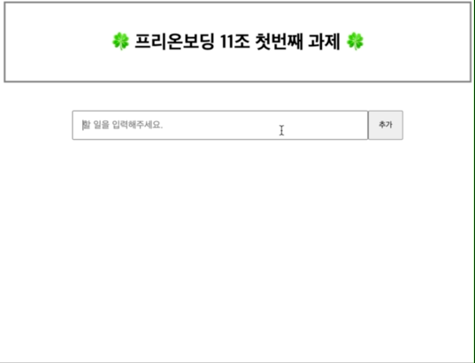
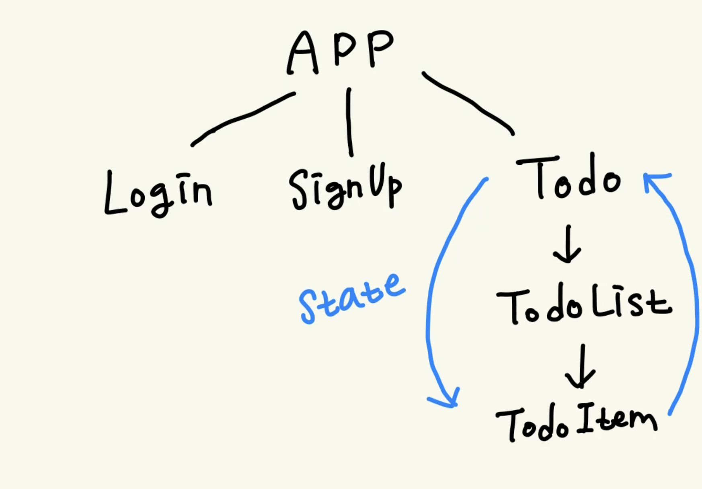

# 원티드 프리온보딩 프론트엔드 11조

### [배포 사이트 바로가기](https://elegant-brigadeiros-178dab.netlify.app/) 👈🏻 click!

[](https://app.netlify.com/sites/elegant-brigadeiros-178dab/deploys)

1. [팀 소개](#팀-소개)
   - 팀원 소개
   - 소통 방식과 과제 진행 방식
2. [프로젝트 소개](#프로젝트-소개)
   - 폴더 구조
   - 프로젝트 구조
3. [우리 팀의 Best Practice](#우리-팀의-best-practice)

---

## 팀 소개

👋 안녕하세요, 원티드 프리온보딩 프론트엔드 11조입니다!

### 팀원 소개

<table>
  <tr>
    <td align="center">
      
    </td>
    <td align="center">
      
    </td>
    <td align="center">
      
    </td>
    <td align="center">
      
    </td>
    <td align="center">
      
    </td>
    <td align="center">
      
    </td>
    <td align="center">
      
    </td>
    <td align="center">
      
    </td>
  </tr>
  <tr>    
    <td align="center">
      <a href="https://github.com/devyouth94">
        <div>김영진</div>
      </a>
    </td>
    <td align="center">
      <a href="https://github.com/SimYuseon">
        <div>심유선</div>
      </a>
    </td>
    <td align="center">
      <a href="https://github.com/hemudi">
        <div>김수민</div>
      </a>
    </td>
    <td align="center">
      <a href="https://github.com/ryong9rrr">
        <div>용상윤(팀장)</div>
      </a>
    </td>
    <td align="center">
      <a href="https://github.com/HyunziLee">
        <div>이현지</div>
      </a>
    </td>
    <td align="center">
      <a href="https://github.com/chaechae66">
        <div>박채연</div>
      </a>
    </td>
    <td align="center">
      <a href="https://github.com/6mn12j">
        <div>박민주</div>
      </a>
    </td>
    <td align="center">
      <a href="https://github.com/0SCAR0421">
        <div>정연우</div>
      </a>
    </td>
  </tr>
</table>

### 소통 방식과 과제 진행 방식

저희 팀은 소통 방식으로 디스코드와 노션을 활용했습니다. 디스코드에서 어떤 방식이 더 나을지 투표를 하거나 어떤 코드가 좋은 코드일지 토론을 하였습니다.

토론 후 전체적인 과제 진행은 팀장이 진행하였습니다. 그리고 1명이 대표로 라이브코딩을 하고 1명이 회의록을 작성하였습니다. 나머지 팀원들은 라이브코딩에 모두 참여하여 네이밍 컨벤션이나 코드 구조 등에 대해 피드백을 주고 받으며 Best Practice를 찾기 위해 노력했습니다.

---

## 프로젝트 소개

<div align="center">

</div>

- 로그인 페이지, 회원가입 페이지, 투두리스트 페이지가 존재하는 SPA 입니다.

- 유저는 회원가입과 로그인을 할 수 있고 로그인한 유저만 투두리스트 페이지에 접근할 수 있습니다.

- 투두리스트는 기본적인 CRUD 기능이 있습니다.

### 폴더 구조

### 프로젝트 구조

<div align="center">

</div>

- 총 3개의 페이지를 가지고 있습니다.

- 최상단의 `ProtectedRouter`라는 컴포넌트는 App을 감싸고 있습니다. `ProtectedRouter`는 검증하고 싶은 특정 페이지만 인증 유무를 판단하기 때문에 다른 전역 상태 관리 없이도 인증된 유저인지 아닌지를 판단할 수 있습니다.

- TodoPage는 맨 처음 네트워크에서 할 일 목록을 불러옵니다. 그리고 TodoList - TodoItem 컴포넌트로 데이터를 차례대로 내려주어 단방향 데이터 흐름을 갖습니다.
  - TodoList는 단순히 TodoItem을 렌더링합니다.
  - TodoItem 또한 Todo를 렌더링 하는 역할만 합니다.
  - TodoItem에서 일어나는 상태변화는 TodoItem에서 처리하지 않고 상태가 모여있는 TodoPage에서 처리하게끔 하여 단방향 데이터 흐름을 유지합니다.

---

## 우리 팀의 Best-Practice

### 1. 타입스크립트, 사용할까요?

**타입스크립트는 개발자 경험을 향상시킵니다.**

자바스크립트는 타입을 지원하지 않는 점에서 빠르게 개발을 할 수 있다는 장점이 있습니다. 하지만 더불어 잠재적인 에러를 불러일으킬 수도 있어요. 타입스크립트 사용은 조금 시간이 걸릴 수도 있겠지만 잘 사용한다면 잠재적인 에러를 사전에 검출할 수도 있고 개발자 경험이 매우 높아집니다. 예를 들어 자바스크립트로만 개발할 경우 Todo 라는 객체 안에 어떤 프로퍼티가 존재하는지 모를 수 있습니다. (jsDoc 같은 것을 사용하지 않는다면) 하지만 타입스크립트는 모두 타입을 정의해주어야 하기 때문에 가독성이 크게 향상됩니다.

### 2. 라우팅과 리다이렉트

- 🤔 **Context API를 사용하지 않고도 유저 인증을 할 수 있을까?**

- 🤔 라우터가 바로 페이지 컴포넌트를 불러오지 않고 **페이지 컴포넌트를 children으로 가지는 컴포넌트를 불러온다면?**

Context API는 좋은 기능이지만 팀 내부에서 정말 신선하면서도 좋은 방법으로 선정된 `ProtectedRouter` 방법을 채택했습니다.

일반적으로 react-router-dom의 `Route`는 바로 페이지 컴포넌트를 불러오는 식으로 사용됩니다.

```tsx
<Route
  path={이동시킬 url}
  element={
    <ProtectedRoute>
      페이지 컴포넌트
    </ProtectedRoute>
  }
/>
```

하지만 이렇게 컴포넌트를 한 번 감싸주고, 내부에서 토큰이 유효하지 않다면 리다이렉트를 시켜버리는 방식으로 할 수도 있습니다. 이 방법은 Route 구조가 다소 복잡하다고 느껴질 수도 있지만 특정 페이지만 정확하고 효율적으로 검증이 가능합니다.

### 3. Form 유효성 검사, 어떻게 하면 효율적으로 할 수 있을까요?

폼의 유효성을 검사하는 것은 매우 번거롭습니다. 또 **유저에게 피드백을 주는 시점**을 정하는 것도 쉽지 않습니다.

우선 유저에게 피드백을 주는 시점은 유저가 필드를 입력하고 필드에서 빠져나왔을 때, 즉 `blur` 됐을 때가 가장 최적이라고 판단하였습니다.

또한 `useInputValidation`이라는 훅을 구현하여 사용하는 쪽에서 매우 쉽고 간편하게 우리가 원하는 기능을 구현할 수 있었습니다.

#### 훅을 사용하지 않는다면 이런 일이 일어날지도 몰라요.

```tsx
const [email, setEmail] = useState<Field>({...})
const [password, setPassword] = useState<Field>({...})
const [passwordConfirm, setPasswordConfirm] = useState<Field>({...})

const handleChangeEmail = ...
const handleChangePassword = ...
const handleChangePasswordConfirm = ...
const handleBlurEmail = ...
const handleBlurPassword = ...
const handleSubmit = ...

...
```

#### useInputValidation을 사용한다면

사용하는 쪽에서의 코드는 매우 간결해집니다. 또한 유효성 검사를 수행하는 `validate`를 따로 분리할 수도 있어요.

```tsx
const { values, validationResults, isAllPass, eventHandler } = useInputValidation({
  names: ["email", "password", "checkPassword"],
  validate,
});
```

### 4. API의 모듈화

사용하는쪽에서 메서드의 이름으로만 어떤 api인지 알 수 있습니다!

```tsx
export const todoAPI = {
  getTodos: ...
  addTodo: ...
  deleteTodo: ...
  upDateTodo: ...
};
```

### 5. 그 외

- 팀의 코딩 스타일을 통일하기 위해 ESLint, prettier, git husky를 적극 활용하였습니다.

- 원시형 값(url 경로 등)들을 그대로 사용하는 것을 최대한 지양하고, 상수화 시켰습니다.

- onChange ~ handleChange 처럼 개개인마다 명명법이 다르기 쉬운 메서드 명을 통일하였습니다.

- 네트워크 요청을 하는 부분은 반드시 에러 핸들링을 합니다.

- 리액트 컴포넌트 뿐 아니라 로컬스토리지, 디바운스 같이 어디서나 사용될 수 있는 모듈은 가급적 최대한 분리시켰습니다.
